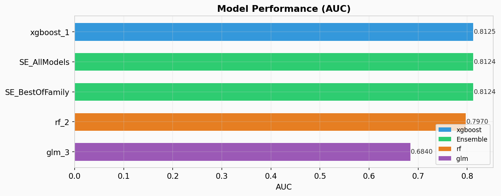
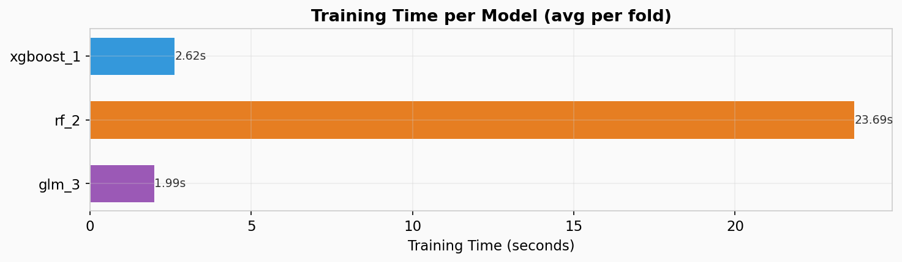

<p align="center">
  
</p>

<h1 align="center">PagedAutoML</h1>

<p align="center">
  <strong>H2O AutoML의 전략을 GPU에서 재구현하고, 메모리 관리 방향을 탐색하는 연구 프로젝트</strong>
</p>

<p align="center">
  
  
  
  
  
  
</p>

---

## What This Project Is

H2O AutoML은 10년간 검증된 Stacking/HPO 전략을 가지고 있지만, Java/CPU 기반이라 GPU에서 직접 사용할 수 없다.
이 프로젝트는 **H2O의 전략을 분석하고, RAPIDS 생태계(cuDF, cuML, XGBoost GPU)로 재구현**한 뒤,
GPU 환경에서의 **메모리 관리 문제를 탐색**하는 연구 프로젝트이다.

### 실제로 달성한 것

- H2O의 Stacking(5-fold CV + OOF + Two-Type Ensemble)을 GPU에서 재현하고, 실제 데이터(129만 행)로 검증
- H2O의 3-Phase 훈련 전략(Baseline -> Diversity -> Random Search)이 GPU에서도 유효함을 확인
- VRAM 프로파일링을 Leaderboard에 포함하여 모델별 GPU 메모리 사용량을 정량화
- Memory-Aware Scheduling(v1)으로 VRAM 부족 시 OOM 대신 안전한 skip 처리

### 아직 검증되지 않은 것

- **Memory-Aware의 실효성**: Credit Card(1.29M)에서는 전부 통과, Higgs(5M)에서는 rmm pool 설정에 따라 전부 skip. "적절히 일부만 skip하고 일부는 실행"하는 시나리오를 아직 재현하지 못함
- **CPU 대비 속도**: H2O CPU와의 동일 조건 비교 미실시. "10 ~ 40배"는 RAPIDS 공식 수치이며 직접 측정한 것이 아님
- **GLM 수렴 실패**: cuML LogisticRegression이 극도의 클래스 불균형에서 수렴 실패 (AUC 0.52). H2O GLM은 이 상황을 처리하므로 완전한 전략 재현은 아님

### "PagedAutoML" 이름에 대하여

프로젝트명은 vLLM의 PagedAttention에서 영감을 받아 **GPU AutoML에서도 Page 기반 메모리 관리가 필요하다**는 방향성을 담고 있다. 다만 현재 구현은 vLLM 수준의 paging이 아니며, 이 차이를 솔직히 기술한다.

| | vLLM PagedAttention | 현재 PagedAutoML |
|:--|:---------------------|:-----------------|
| 관리 시점 | 연산 **도중** (Attention 커널 안) | 연산 **사이** (task 시작/끝) |
| 관리 단위 | token 16개 (수 KB) | model 1개 (수 GB) |
| 핵심 기술 | 커스텀 CUDA 커널로 비연속 메모리 접근 | Python에서 블록 수 확인 후 할당/해제 |
| GPU 메모리 활용률 | 20% -> **96%** (논문 검증) | **미검증** (벤치마크 미사용) |
| 구현 난이도 | CUDA C++ 커널 개발 | Python 자료구조 |

**왜 vLLM 수준이 안 되는가**: cuML, XGBoost는 블랙박스 라이브러리이다. 훈련 도중 내부 메모리 접근 패턴을 제어할 수 없으므로, vLLM처럼 "연산 중 Page Table 참조"가 불가능하다. 현재 구현은 **task 경계에서의 coarse-grained 메모리 관리**이며, 이는 일반적인 메모리 풀 관리 + LRU eviction에 가깝다.

**PagedMemoryManager의 현재 상태**: 코드는 구현되어 있으나(`paged_automl/memory/paged_manager.py`), 실제 벤치마크에서 `paged_memory=True`로 사용된 적이 없다. 블록 할당/회수/swap의 실효성은 미검증이다.

---

## The Journey

### Phase 1: Research — H2O AutoML 분석

H2O AutoML의 Stacking, HPO, 훈련 전략을 심층 분석했다. <br/>
**Key Insight**: H2O의 가치는 코드가 아니라 10년간 검증된 **전략**에 있다.

-> [docs/01-research/](docs/01-research/)

### Phase 2: Design — GPU 재설계

RAPIDS 위에서 H2O 전략을 재조립하고, 메모리 관리 아키텍처를 설계했다. <br/>
**Key Insight**: RAPIDS가 부품을 제공하지만, AutoML 파이프라인으로 조립하는 것은 별도의 작업이다.

-> [docs/02-design/](docs/02-design/)

### Phase 3: Build — 구현 & 검증

`paged_automl/` 프레임워크를 구현하고, RTX 4060 (8GB)에서 실제 데이터로 검증했다. <br/>
**Key Insight**: H2O 전략은 GPU에서 유효하지만, 메모리 관리의 실효성은 더 큰 규모에서 검증이 필요하다.

-> [docs/03-results/](docs/03-results/)

---

## Results

두 개의 실제 데이터셋으로 벤치마크를 수행했다. RTX 4060 (8GB VRAM) 기준.

### Benchmark 1: Credit Card Fraud (1.29M rows x 11 features)

> 10 base models + 2 ensembles, **181초 완료**

<p align="center">
  
</p>

| 순위 | 모델 | AUC | 의미 |
|:----:|------|:---:|------|
| 1 | xgboost_6 (Diversity) | 0.9980 | Baseline 대비 +0.27%. H2O Diversity 전략 유효 |
| 2 | SE_BestOfFamily | 0.9973 | XGBoost 72% + RF 28%. GLM은 자동 제외 |
| 11 | glm_3 | 0.5181 | 수렴 실패 (클래스 불균형 0.58%) |

- Memory-Aware: 모든 모델 VRAM 체크 통과, OOM 0건
- 129만 행에서는 모델당 0.006 ~ 0.038 GB -> 8GB GPU에서 충분한 여유

### Benchmark 2: Higgs Boson (5M rows x 28 features)

> 3 base models + 2 ensembles, **153초 완료**

<p align="center">
  
</p>

| 순위 | 모델 | AUC | Training Time |
|:----:|------|:---:|:------------:|
| 1 | xgboost_1 | 0.8125 | 2.6s |
| 2 | SE_AllModels | 0.8124 | - |
| 4 | rf_2 | 0.7970 | 23.7s |
| 5 | glm_3 | 0.6840 | 2.0s |

**Memory-Aware가 실제로 의미를 가지는 규모**:
- rmm pool ON (4GB 선점) -> free 0.66GB -> **모든 모델 skip** (파이프라인 실행 불가)
- rmm pool OFF -> free 4.80GB -> XGBoost(4.12GB) 통과 -> **정상 실행**
- 현재 Memory-Aware는 "skip or proceed" 이진 판단만 가능. pool 내부를 세밀하게 관리하는 진짜 paging은 아직 구현되지 않음

<p align="center">
  
</p>

상세 해석: [docs/03-results/benchmark_interpretation.md](docs/03-results/benchmark_interpretation.md)

---

## Limitations

이 프로젝트의 현재 한계를 솔직히 기술한다.

### 1. Memory-Aware는 "skip"만 할 수 있다

현재 Memory-Aware Scheduling은 훈련 전에 VRAM을 체크하고, 부족하면 해당 모델을 skip한다. vLLM처럼 "메모리를 재배치해서 실행 가능하게 만드는" 능력이 없다. Higgs(5M rows)에서 rmm pool이 4GB를 선점하면 **모든 모델이 skip되어 AutoML 자체가 불가능**해진다.

### 2. PagedMemoryManager는 아직 이론이다

`paged_manager.py`에 블록 할당/회수/LRU eviction/swap 코드가 있지만, 실제 AutoML 파이프라인에서 사용한 적이 없다. `automl.py`에서 `paged_memory=False`가 기본값이고, 벤치마크도 이 기능 없이 실행되었다.

### 3. cuML/XGBoost 내부를 제어할 수 없다

vLLM은 Attention 커널을 직접 작성하여 비연속 메모리를 참조할 수 있다. 우리는 cuML RF, XGBoost를 블랙박스로 사용하므로, **모델 훈련 도중의 메모리를 제어할 수 없다**. 이것이 "task-level coarse-grained paging"에 머무는 근본적 이유이다.

### 4. CPU H2O와의 비교가 없다

"GPU가 빠르다"는 주장에 대한 직접적 근거가 없다. 같은 데이터, 같은 시간 예산으로 H2O CPU를 돌린 비교 실험을 수행하지 않았다.

### 5. GLM이 불완전하다

cuML LogisticRegression은 극도의 클래스 불균형에서 L-BFGS가 수렴에 실패한다. H2O의 GLM은 이를 처리하므로, "H2O 전략의 완전한 재현"이라고 할 수 없다. 3개 알고리즘 중 1개가 특정 조건에서 동작하지 않는 것이다.

---

## Future Directions

### 단기 (현재 프레임워크 내에서 가능)

1. **CPU H2O 동일 조건 벤치마크**: 같은 데이터, 같은 `max_runtime_secs`로 H2O CPU를 돌려서 속도를 직접 비교
2. **PagedMemoryManager 실사용 검증**: `paged_memory=True`로 Higgs 데이터를 돌려서 블록 할당/회수가 실제로 skip을 줄이는지 확인
3. **GLM class_weight 적용**: cuML GLM에 클래스 가중치를 부여하여 불균형 데이터 대응
4. **rmm pool 전략 비교**: None / Fixed / Managed / Adaptive 4가지를 같은 조건에서 비교
5. **16GB+ GPU 벤치마크**: Higgs 전체(11M rows)를 돌려서 Memory-Aware의 "부분 skip" 시나리오 재현

### 중기 (아키텍처 변경 필요)

6. **rmm Custom Allocator**: rmm의 device_memory_resource를 상속하여 블록 단위 할당을 cuML/XGBoost에 투명하게 적용. 이렇게 하면 라이브러리 내부 할당도 블록 관리 가능
7. **Dask worker 단위 메모리 관리**: `device_memory_limit` + Dask resource annotation으로 worker별 VRAM 예산 관리
8. **모델 체크포인트 swap**: 훈련 중간 결과를 Host로 swap하고, VRAM이 확보되면 resume. cuML은 미지원이지만 XGBoost의 callback으로 부분 구현 가능

### 장기 (연구 수준)

9. **cuML 내부 메모리 API**: cuML이 메모리 접근 패턴을 외부에 노출하면, vLLM처럼 연산 중 Page Table 참조가 가능해진다. 이것이 진정한 "fine-grained paging"의 전제 조건
10. **GPU AutoML 전용 커널**: Stacking의 OOF 수집, Meta Learner 훈련 등 AutoML 특화 연산을 CUDA 커널로 작성하면, 해당 구간에서는 vLLM 수준의 메모리 관리가 가능

---

## Quick Start

### Requirements

| 항목 | 요구사항 |
|:----:|:--------|
| GPU | NVIDIA, Compute Capability 7.0+, VRAM 8GB+ |
| Driver | 580.65+ (CUDA 13) |
| Python | 3.12+ |
| OS | Linux (Ubuntu 22.04+) 또는 WSL2 |

### Installation

```bash
git clone https://github.com/ModulabsRAPIDSLAB/H2O_AutoML.git
cd H2O_AutoML

uv venv --python 3.12
uv sync   # 타임아웃 시: UV_HTTP_TIMEOUT=300 uv sync
```

### Usage

```python
from paged_automl import GPUAutoML

automl = GPUAutoML(
    max_runtime_secs=300,
    max_models=20,
    memory_aware=True,
    memory_profile=True,
)

automl.fit(X_train, y_train)
print(automl.leaderboard())            # 성능 + peak_vram 포함
print(automl.get_memory_report())      # 단계별 VRAM 리포트
preds = automl.predict(X_test)
```

### Run Tests

```bash
source .venv/bin/activate

# E2E 테스트
python -m tests.test_e2e_gpu --rows 10000 --features 20 --models 5

# 벤치마크 차트 생성
python scripts/generate_charts.py --from-json assets/results/benchmark_credit_card.json
```

---

## Architecture

```
GPUAutoML.fit()
  |
  +- Data: cuDF load -> Preprocessor (GPU-native)
  |
  +- Orchestrator (H2O Strategy)
  |    +- Phase A: Baseline (default HP per algorithm)
  |    +- Phase B: Diversity (pre-specified HP grids)
  |    +- Phase C: Random Search (until time budget)
  |
  +- Memory-Aware Scheduler (v1: skip or proceed)
  |    +- VRAMEstimator.estimate()   -> VRAM 예측
  |    +- profiler.get_free_vram()   -> 가용 VRAM 체크
  |    +- (미래) PagedMemoryManager  -> 블록 단위 관리
  |
  +- 5-fold CV + OOF Collection
  |    +- cuML RF / cuML GLM / XGBoost GPU
  |    +- Streaming OOF (VRAM 절약)
  |
  +- Stacked Ensemble
       +- All Models Ensemble
       +- Best of Family Ensemble
       +- Non-negative GLM Meta Learner (post-hoc clipping)
```

상세 설계: [docs/02-design/architecture.md](docs/02-design/architecture.md)

---

## Project Structure

```
H2O_AutoML/
+-- paged_automl/            # GPU AutoML 프레임워크
|   +-- automl.py            #   GPUAutoML (sklearn-compatible API)
|   +-- orchestrator.py      #   H2O training strategy + time control
|   +-- scheduler.py         #   Memory-Aware + Continuous Scheduler
|   +-- data/                #   cuDF loader, K-fold CV, preprocessor
|   +-- models/              #   XGBoost GPU, cuML RF, cuML GLM
|   +-- ensemble/            #   Stacked Ensemble + Meta Learner
|   +-- memory/              #   Profiler, Estimator, rmm Pool, PagedMemoryManager
|   +-- hpo/                 #   Random Search + presets
|   +-- reporting/           #   Leaderboard + memory report
+-- docs/
|   +-- 01-research/         #   Phase 1: H2O AutoML 분석
|   +-- 02-design/           #   Phase 2: GPU 재설계 + PRD + architecture
|   +-- 03-results/          #   Phase 3: 벤치마크 결과 + 해석 가이드
+-- notebooks/               #   01 H2O demo, 02 explain, 03 design, 04 benchmark
+-- tests/                   #   E2E GPU 통합 테스트
+-- scripts/                 #   차트 생성
+-- assets/results/          #   벤치마크 차트 + JSON
```

---

## Notebooks

| # | Notebook | 내용 |
|:-:|----------|------|
| 1 | [01_h2o_automl_demo](notebooks/01_h2o_automl_demo.ipynb) | H2O AutoML CPU baseline 데모 |
| 2 | [02_explainability](notebooks/02_explainability.ipynb) | h2o.explain() 시각화 |
| 3 | [03_gpu_native_redesign](notebooks/03_gpu_native_redesign.ipynb) | GPU 매핑 분석 (개념 설계, 읽기만) |
| 4 | [**04_paged_automl_benchmark**](notebooks/04_paged_automl_benchmark.ipynb) | **Credit Card Fraud 1.29M rows GPU 벤치마크** |

---

## References

- LeDell, E., & Poirier, S. (2020). *H2O AutoML: Scalable Automatic Machine Learning.* 7th ICML Workshop on AutoML.
- Bergstra, J., & Bengio, Y. (2012). *Random Search for Hyper-Parameter Optimization.* JMLR.
- Kwon, W., et al. (2023). *Efficient Memory Management for Large Language Model Serving with PagedAttention.* SOSP.
- [RAPIDS Documentation](https://docs.rapids.ai/)
- [H2O AutoML Documentation](https://docs.h2o.ai/h2o/latest-stable/h2o-docs/automl.html)

## Troubleshooting

[docs/troubleshooting.md](docs/troubleshooting.md)
