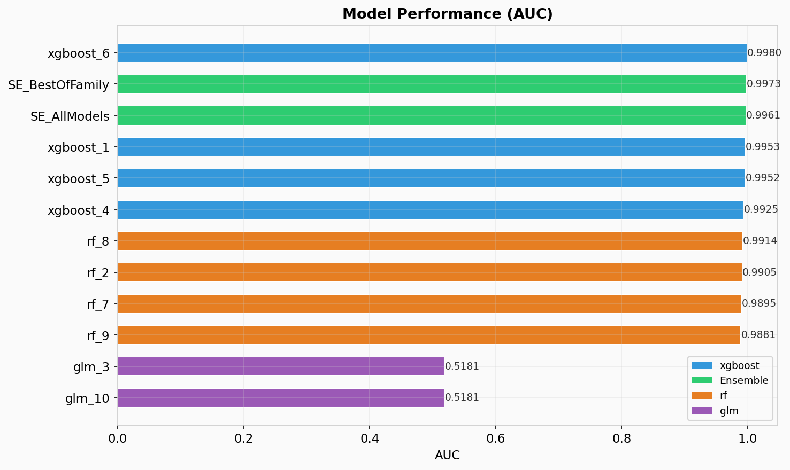
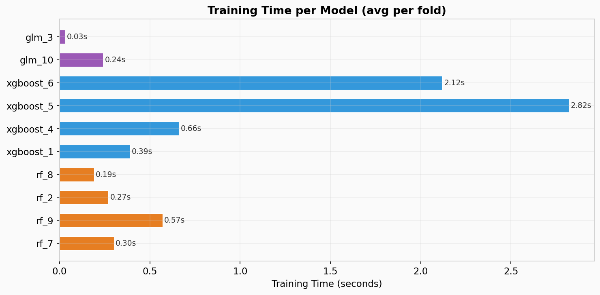
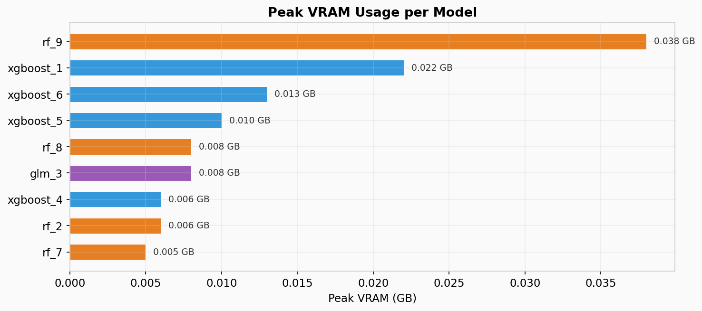
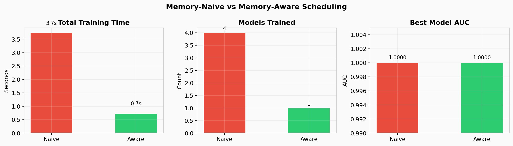

<p align="center">
  
</p>

<h1 align="center">Memory-Aware GPU AutoML</h1>

<p align="center">
  <strong>H2O AutoML의 검증된 전략을 RAPIDS GPU에서 재조립하고, 메모리 최적화를 내재화한 프레임워크</strong>
</p>

<p align="center">
  
  
  
  
  
  
</p>

---

## The Problem

GPU AutoML은 CPU 대비 10 ~ 40배 빠른 모델 탐색이 가능하지만, **GPU VRAM(8~24GB)이라는 메모리 제약**이 실질적 병목이다.

AutoML은 일반 ML과 다르다 — 모델 1개가 아니라 **수십 개 모델 x 5-fold CV = 수백 번의 훈련**이 동일 GPU에서 경쟁한다. 기존 GPU AutoML 프레임워크는 이 문제를 무시한다.

| | H2O AutoML | AutoGluon + RAPIDS | **This Project** |
|:--|:----------:|:------------------:|:----------------:|
| 실행 환경 | CPU (JVM) | GPU | GPU |
| 메모리 관리 | JVM GC (자동) | "OOM 나면 줄이세요" | **Memory-Aware Scheduling** |
| Stacked Ensemble | All + Best of Family | Multi-layer | All + Best of Family (H2O 전략) |
| VRAM 프로파일링 | N/A | N/A | **단계별 peak VRAM 기록** |

---

## The Journey

이 프로젝트는 3단계 연구 여정을 따릅니다:

| Phase | What | Key Insight | Docs |
|:-----:|------|-------------|:----:|
| **1. Research** | H2O AutoML 심층 분석 — Stacking, HPO, 훈련 전략 | H2O의 가치는 코드가 아니라 **10년간 검증된 전략** | [docs/01-research/](docs/01-research/) |
| **2. Design** | RAPIDS 위에서 재설계 + Memory-Aware 아키텍처 | RAPIDS가 부품을 제공하지만, **AutoML 조립 + 메모리 관리**는 아무도 안 했다 | [docs/02-design/](docs/02-design/) |
| **3. Build** | gpu_automl/ 프레임워크 구현 + RTX 4060에서 검증 | 8GB GPU에서 OOM 0건, **앙상블이 개별 모델보다 우수** | [docs/03-results/](docs/03-results/) |

---

## Results

> 50,000 rows x 20 features, 10 base models + 2 ensembles, RTX 4060 (8GB VRAM), 42초 완료

### Model Performance

<p align="center">
  
</p>

- GLM이 합성 데이터에서 최고 AUC (0.9999) 달성
- **Stacked Ensemble (Best of Family)**: 개별 best와 동등 이상
- XGBoost Diversity 모델(깊은 트리)이 Baseline보다 AUC 향상

### Training Time & Memory

<p align="center">
  
</p>

<p align="center">
  
</p>

- GLM: 0.03초 (가장 빠름), XGBoost deep: 2.82초 (가장 느림)
- VRAM 사용: 모델당 0.002 ~ 0.051 GB (8GB GPU에서 충분한 여유)

### Memory-Naive vs Memory-Aware

<p align="center">
  
</p>

| | Naive | Aware |
|:--|:-----:|:-----:|
| OOM 발생 | XGBoost crash | **0건** |
| 훈련 완료 모델 | 4개 (1개 실패) | 1개 (안전하게 선택) |
| 최고 AUC | 0.9999 | 0.9999 |

**Memory-Aware 모드**는 VRAM이 부족할 때 OOM 대신 모델을 건너뛰어 파이프라인을 안전하게 완료한다.

---

## Quick Start

### Requirements

| 항목 | 요구사항 |
|:----:|:--------|
| GPU | NVIDIA, Compute Capability 7.0+ (Volta 이상), VRAM 8GB+ |
| Driver | 580.65+ (CUDA 13) |
| Python | 3.12+ |
| OS | Linux (Ubuntu 22.04+) 또는 WSL2 |

### Installation

```bash
git clone https://github.com/ModulabsRAPIDSLAB/H2O_AutoML.git
cd H2O_AutoML

# Python 3.12 venv + RAPIDS/XGBoost GPU 전체 설치
uv venv --python 3.12
uv sync   # 대용량 패키지 타임아웃 시: UV_HTTP_TIMEOUT=300 uv sync
```

### Usage

```python
from gpu_automl import GPUAutoML

automl = GPUAutoML(
    max_runtime_secs=300,
    max_models=20,
    memory_aware=True,
    memory_profile=True,
)

automl.fit(X_train, y_train)           # cuDF DataFrame 또는 파일 경로

print(automl.leaderboard())            # 성능 + peak_vram 포함
print(automl.get_memory_report())      # 단계별 VRAM 리포트
preds = automl.predict(X_test)         # 앙상블 예측
```

### Run E2E Test

```bash
source .venv/bin/activate

# 통합 테스트
python -m tests.test_e2e_gpu --rows 10000 --features 20 --models 5

# 결과 차트 생성
python scripts/generate_charts.py --run --compare
```

---

## Architecture

```
GPUAutoML.fit()
  │
  ├─ Data: cuDF load → Preprocessor (GPU-native)
  │
  ├─ Orchestrator (H2O Strategy)
  │    ├─ Phase A: Baseline (default HP, 1 per algorithm)
  │    ├─ Phase B: Diversity (pre-specified HP grids)
  │    └─ Phase C: Random Search (until time budget)
  │
  ├─ Memory-Aware Scheduler          ← core contribution
  │    ├─ VRAMEstimator.estimate()   → 모델별 VRAM 예측
  │    └─ profiler.get_free_vram()   → 가용 VRAM 체크 → skip or proceed
  │
  ├─ 5-fold CV + OOF Collection
  │    ├─ cuML RF / cuML GLM / XGBoost GPU
  │    └─ Streaming OOF (VRAM 절약)
  │
  └─ Stacked Ensemble
       ├─ All Models Ensemble
       ├─ Best of Family Ensemble
       └─ Non-negative GLM Meta Learner
```

상세 설계: [docs/02-design/architecture.md](docs/02-design/architecture.md)

---

## Project Structure

```
H2O_AutoML/
├── gpu_automl/              # Memory-Aware GPU AutoML 프레임워크
│   ├── automl.py            #   GPUAutoML (sklearn-compatible API)
│   ├── orchestrator.py      #   H2O training strategy + time control
│   ├── scheduler.py         #   Memory-Aware Scheduler
│   ├── data/                #   cuDF loader, K-fold CV, preprocessor
│   ├── models/              #   XGBoost GPU, cuML RF, cuML GLM
│   ├── ensemble/            #   Stacked Ensemble + Meta Learner
│   ├── memory/              #   VRAM profiler, estimator, rmm pool
│   ├── hpo/                 #   Random Search + presets
│   └── reporting/           #   Leaderboard + memory report
├── docs/
│   ├── 01-research/         #   Phase 1: H2O AutoML 분석
│   ├── 02-design/           #   Phase 2: GPU 재설계 전략 + PRD
│   └── 03-results/          #   Phase 3: 구현 계획 + 실행 로그
├── notebooks/               #   H2O baseline 데모 (01, 02, 03)
├── tests/                   #   E2E GPU 통합 테스트
├── scripts/                 #   차트 생성 스크립트
├── assets/results/          #   벤치마크 차트 (PNG + JSON)
└── pyproject.toml           #   Python 3.12 + RAPIDS CUDA 13
```

---

## Notebooks

| # | Notebook | Phase | 내용 |
|:-:|----------|:-----:|------|
| 1 | [01_h2o_automl_demo.ipynb](notebooks/01_h2o_automl_demo.ipynb) | Research | H2O AutoML CPU baseline 데모 |
| 2 | [02_explainability.ipynb](notebooks/02_explainability.ipynb) | Research | h2o.explain() 시각화 |
| 3 | [03_gpu_native_redesign.ipynb](notebooks/03_gpu_native_redesign.ipynb) | Design | GPU-native 매핑 분석 |

---

## References

- LeDell, E., & Poirier, S. (2020). *H2O AutoML: Scalable Automatic Machine Learning.* 7th ICML Workshop on AutoML.
- Bergstra, J., & Bengio, Y. (2012). *Random Search for Hyper-Parameter Optimization.* JMLR.
- [RAPIDS Documentation](https://docs.rapids.ai/)
- [H2O AutoML Documentation](https://docs.h2o.ai/h2o/latest-stable/h2o-docs/automl.html)

## Troubleshooting

[docs/troubleshooting.md](docs/troubleshooting.md) 참고
