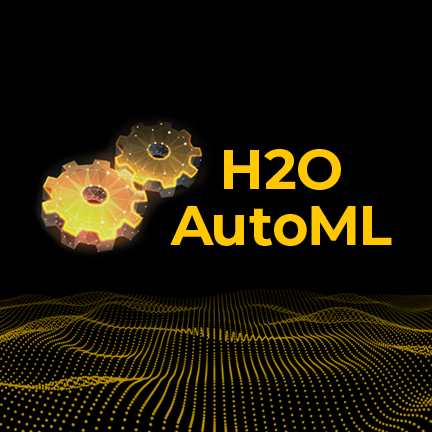

<p align="center">
  
</p>

<h1 align="center">H2O AutoML</h1>

<p align="center">
  <strong>Pandas 이후, RAPIDS 이전 — 자동화와 병렬 처리의 교차점</strong><br/>
  RAPIDS LAB 세미나 시리즈: ML 프레임워크 히스토리
</p>

<p align="center">
  
  
  
  
  
  
  
  
  
</p>

---

## Compatibility Matrix

| Dependency | Required Version | Note |
|:----------:|:----------------:|:-----|
| **Python** | `3.6 ~ 3.11` (본 레포: `3.9.4`) | H2O 공식 지원 범위. `3.12+`는 미지원 |
| **Java (JVM)** | `17+` (OpenJDK 권장) | H2O 런타임 엔진. 반드시 사전 설치 필요 |
| **H2O** | `3.46.0.10` | 현재 최신 안정 버전 |
| **XGBoost GPU** | CUDA `8+` + NVIDIA GPU | 선택사항. CPU-only 환경에서도 동작 |
| **OS** | Linux / macOS (Intel) | Apple Silicon(M1+)에서 XGBoost 비활성 |
| **uv** | `0.1+` | Python 패키지 매니저 (pip 대체) |
| **pyenv** | `2.0+` | Python 버전 관리 |

---

## Quick Start

### 0. 사전 요구사항 확인

```bash
# Java 17+ 확인 (없으면 brew install openjdk@17)
java -version

# pyenv 확인 (없으면 brew install pyenv)
pyenv --version

# uv 확인 (없으면 curl -LsSf https://astral.sh/uv/install.sh | sh)
uv --version
```

### 1. 레포지토리 클론

```bash
git clone https://github.com/ModulabsRAPIDSLAB/H2O_AutoML.git
cd H2O_AutoML
```

### 2. Python 버전 설정 (pyenv)

```bash
# Python 3.9.4 설치 (이미 설치되어 있으면 생략)
pyenv install 3.9.4

# 프로젝트 로컬 버전 고정
pyenv local 3.9.4

# 확인
python --version
# → Python 3.9.4
```

### 3. 가상환경 생성 및 활성화 (uv)

```bash
# uv로 venv 생성 (pyenv의 3.9.4를 자동 감지)
uv venv --python 3.9.4

# 활성화
source .venv/bin/activate
```

### 4. 의존성 설치

```bash
uv pip install h2o jupyter pandas matplotlib seaborn
```

### 5. 데이터셋 다운로드

```bash
# datasets 폴더 생성 + Airlines 데이터셋 다운로드 (~580MB)
mkdir -p datasets
curl -L -o datasets/airlines_all.05p.csv \
  "https://s3.amazonaws.com/h2o-public-test-data/bigdata/laptop/airlines_all.05p.csv"
```

### 6. Jupyter Notebook 실행

```bash
jupyter notebook notebooks/
```

### 7. 데모 실행 순서

| 순서 | 노트북 | 내용 |
|:----:|:-------|:-----|
| 1 | `01_h2o_automl_demo.ipynb` | H2O 초기화 → 데이터 로드 → AutoML 학습 → 리더보드 → 결과 분석 |
| 2 | `02_explainability.ipynb` | `h2o.explain()` 시각화, 변수 중요도, 모델 상관관계 |

---

## H2O AutoML이란?

H2O AutoML은 **H2O.ai**에서 개발한 오픈소스 자동 머신러닝 프레임워크입니다.
사용자가 지정한 시간 또는 모델 수 제한 내에서 다양한 알고리즘을 **자동으로 학습, 튜닝, 앙상블**합니다.

### 핵심 포지셔닝

```
Pandas (단일 스레드)
    ↓ 데이터가 커지면서 한계
Scikit-learn (CPU, 제한적 병렬)
    ↓ 하이퍼파라미터 튜닝 + 모델 선택 자동화 필요
H2O AutoML (JVM 기반 분산 병렬 + 자동화)  ← 여기
    ↓ GPU 가속 필요
RAPIDS cuML (GPU 네이티브 병렬)
```

---

## 핵심 특징

### 1. JVM 기반 분산 병렬 처리
- Java/Scala 기반으로 **멀티코어 자동 활용**
- 단일 머신부터 **멀티노드 클러스터**까지 동일 코드로 확장
- H2O Frame: 자체 인메모리 데이터 구조로 대용량 데이터 처리

### 2. 완전 자동화된 ML 파이프라인
- **6가지 알고리즘** 자동 탐색: GBM, XGBoost, DRF, GLM, DeepLearning, StackedEnsemble
- 하이퍼파라미터 랜덤 그리드 서치 내장
- Cross-validation + Early Stopping 기본 탑재
- **Stacked Ensemble** 자동 생성 (Best of Family + All Models)

### 3. 시간/모델 기반 제어
- `max_runtime_secs`: 전체 탐색 시간 제한
- `max_models`: 탐색할 최대 모델 수
- 둘 다 설정 시 먼저 도달하는 조건에서 중단

### 4. 리더보드 자동 생성
- 5-fold CV 기반 모델 성능 순위표
- 이진분류(AUC), 다중분류(mean_per_class_error), 회귀(RMSE) 기준 자동 정렬
- 학습 시간, 예측 속도 등 부가 정보 제공

### 5. Explainability 내장
- `h2o.explain()` 한 줄로 다중 모델 비교 시각화
- Feature Importance, SHAP, Partial Dependence Plot 등

### 6. 프로덕션 배포 지원
- **MOJO**(Model Object, Optimized) 포맷으로 Java 기반 배포
- sklearn 호환 wrapper 제공 (`h2o.sklearn`)

---

## 언제 H2O AutoML을 사용하는가?

| 시나리오 | 적합도 | 이유 |
|----------|:------:|:-----|
| 빠른 베이스라인 모델 탐색 | **높음** | 코드 몇 줄로 다양한 알고리즘 비교 |
| 대용량 정형 데이터 (수 GB) | **높음** | JVM 분산 처리로 메모리 효율적 |
| 멀티코어 서버 활용 | **높음** | 자동 병렬화, 설정 불필요 |
| GPU 가속이 필수인 경우 | 보통 | XGBoost GPU만 지원, 나머지는 CPU |
| 딥러닝 위주 작업 | 낮음 | MLP만 지원, CNN/RNN 미지원 |
| 실시간 스트리밍 처리 | 낮음 | 배치 학습 중심 |

---

## RAPIDS와의 비교

| 비교 항목 | H2O AutoML | RAPIDS cuML |
|:---------:|:----------:|:-----------:|
| 실행 환경 | JVM (CPU) | CUDA (GPU) |
| 병렬화 방식 | 멀티코어/멀티노드 자동 | GPU 코어 병렬 |
| 데이터 구조 | H2O Frame | cuDF (GPU DataFrame) |
| 자동화 수준 | 완전 자동화 (모델 선택 + 튜닝 + 앙상블) | 개별 알고리즘 수동 구성 |
| 확장성 | 클러스터 스케일아웃 | GPU 메모리 한도 내 |
| 주요 강점 | **자동화 + 앙상블** | **속도 (GPU 가속)** |
| 학습 곡선 | 매우 낮음 | 보통 (CUDA 환경 설정 필요) |

> H2O AutoML은 **"무엇을 학습할지"를 자동화**하고,
> RAPIDS는 **"얼마나 빨리 학습할지"를 가속화**합니다.
> 두 프레임워크는 경쟁이 아닌 **상호 보완적** 관계입니다.

---

## 프로젝트 구조

```
H2O_AutoML/
├── README.md                          # 발표 개요 및 핵심 정리
├── notebooks/
│   ├── 01_h2o_automl_demo.ipynb       # 라이브 데모 (데이터 로드 → AutoML → 결과 분석)
│   └── 02_explainability.ipynb        # 모델 설명 가능성 시각화
├── datasets/                          # 데이터셋 (gitignore)
│   └── airlines_all.05p.csv           # Airlines ~580MB
├── assets/                            # 발표용 이미지
│   └── h2o-automl-logo.png
├── main.py
├── pyproject.toml
└── .python-version                    # 3.9.4
```

---

## 발표 흐름 (10분)

### Phase 1 — 런타임 시작 (1분)
H2O 클러스터 초기화 후 Airlines 데이터셋(~580MB)으로 AutoML 학습 시작.
`max_runtime_secs=300`으로 설정하여 약 5분간 백그라운드 학습.

### Phase 2 — H2O AutoML 설명 (5분)
학습이 돌아가는 동안:
1. **배경**: 왜 AutoML이 필요한가? (Pandas의 한계, 전문가 부족)
2. **핵심 특징**: JVM 병렬, 6가지 알고리즘, Stacked Ensemble
3. **RAPIDS 이전의 위치**: CPU 병렬 + 자동화의 정점
4. **실무 시나리오**: 베이스라인 탐색, sklearn 연동, MOJO 배포

### Phase 3 — 결과 리뷰 (4분)
학습 완료 후:
1. **리더보드 분석**: 모델별 성능, 학습 시간 비교
2. **최고 모델 분석**: Feature Importance, 파라미터 확인
3. **Explainability**: `h2o.explain()` 시각화

---

## 참고 자료

- [H2O AutoML 공식 문서](https://docs.h2o.ai/h2o/latest-stable/h2o-docs/automl.html)
- [H2O GitHub](https://github.com/h2oai/h2o-3)
- LeDell, E., & Poirier, S. (2020). *H2O AutoML: Scalable Automatic Machine Learning.* 7th ICML Workshop on AutoML.
- H2O AutoML 최초 릴리즈: 2017년 6월 6일 (H2O 3.12.0.1)
